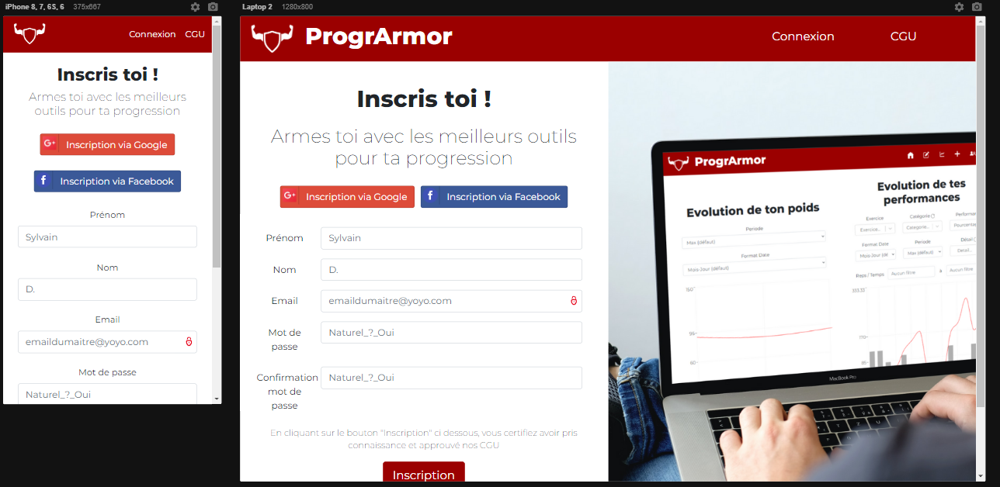
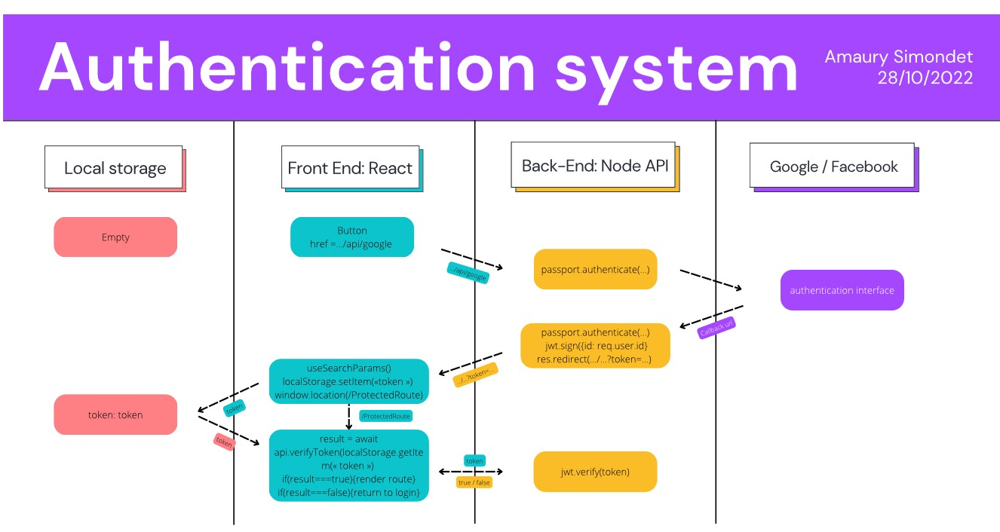
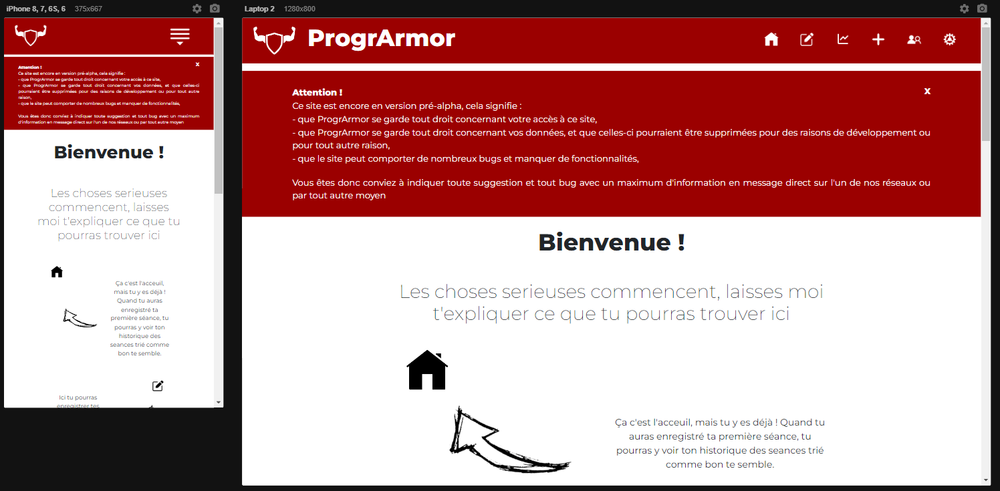
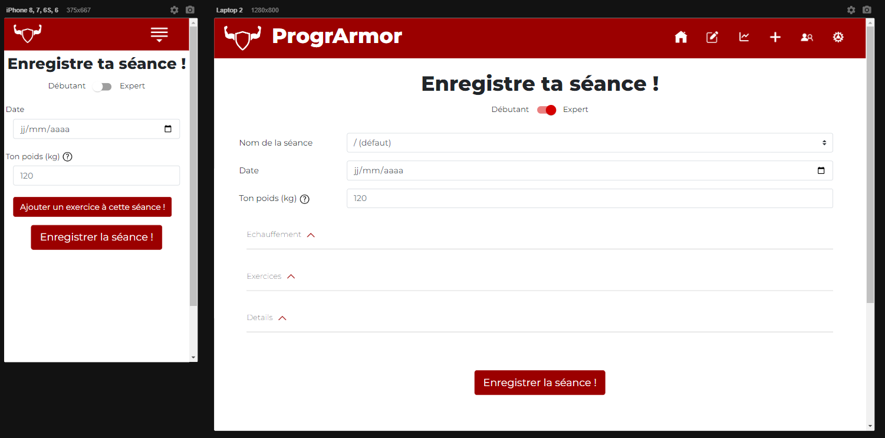
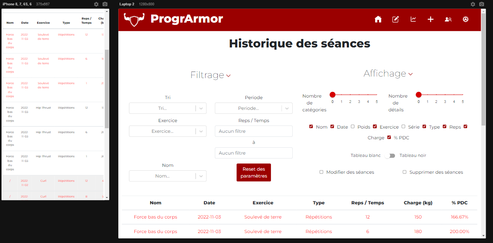
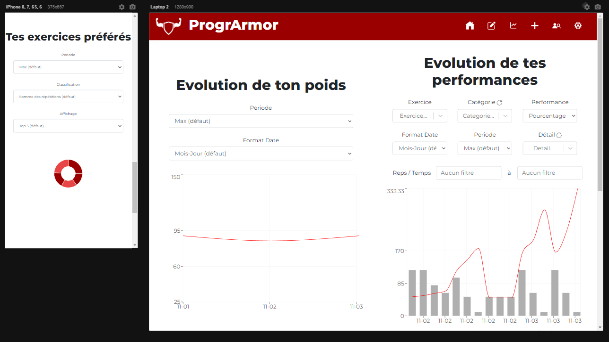
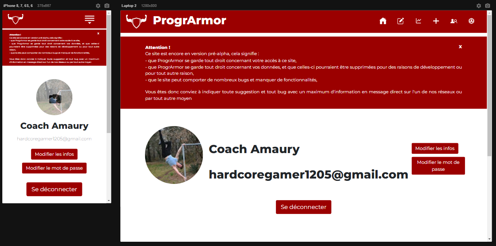

# Amaury Simondet - ProgrArmor 💪

## Salut ! 👋

J'ai réalisé ce site d'outils d'aide à la musculation en projet personnel !

De par ce projet, j'ai pu approfondir mes connaissances en React, CSS et surtout Node Javascript.
Le front-end React communique avec l'API back-end Node pour gérer la base de donnée MongoDB.

## Designs 📸

## Un commentaire ? / Got feedback for me?

J'aime recevoir des commentaires ! Je cherche toujours à améliorer mes projets. Donc, si vous avez quelque chose que vous aimeriez mentionner, veuillez [me contacter](mailto:amaury.simondet@hotmail.com "email") .

Ce projet est ma propriété uniquement et vous ne pouvez pas le partager à des fins commerciales. Cependant, vous pouvez le partager avec toute personne qui le trouvera utile pour la pratique ou comme portfolio.

I love receiving feedback ! I'm always looking to improve my projects. So if you have anything you'd like to mention, please [email me](mailto:amaury.simondet@hotmail.com "email") .

This project is my property only and you can't share it for commercial purpose. However, you can share it with anyone who will find it useful for practice or as my portfolio.

**Merci / Thank you!** 🚀
